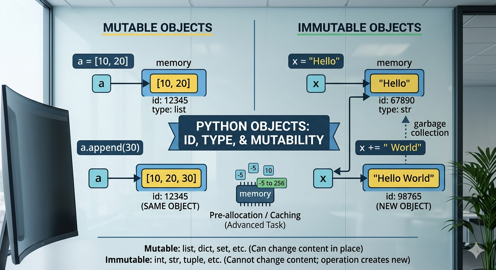

### Python Behind the Scenes: The Truth About Objects and Mutability



## Introduction

In Python, the foundational rule is that "everything is an object." This means every value, variable, function, and class is an instance that carries its own identity and behavior. Unlike languages that separate primitives from objects, Python treats variables as labels bound to objects in memory. Understanding this distinction is crucial for avoiding bugs related to memory allocation and unintended side effects.

## ID and Type

Every object in Python has a unique identity (its memory address, accessed via id()) and a type (its class, accessed via type()). These built-ins help us distinguish between value equality (==) and object identity (is). Even if two objects look the same, they might live in different memory locations.

```
>>> a = [1, 2, 3]
>>> b = a
>>> c = [1, 2, 3]
>>> a is b  # True: b is just another label for a
>>> a is c  # False: c is a separate object in memory

```

## Mutable Objects

Mutable objects are those whose state can be changed after creation without creating a new object. Types like list, dict, and set allow you to add or remove elements in-place. This is memory-efficient but requires caution when multiple variables point to the same object.

```
>>> my_list = [10, 20]
>>> initial_id = id(my_list)
>>> my_list.append(30)
>>> print(id(my_list) == initial_id) # True: The object stayed the same!
```

## Immutable Objects

In contrast, Immutable objects like int, float, str, and tuple cannot be modified. Any attempt to change them results in the creation of a brand-new object. This provides data safety and allows Python to optimize memory through techniques like "interning".

```
>>> x = 100
>>> old_id = id(x)
>>> x += 1
>>> print(id(x) == old_id) # False: A new integer object was created
```

## Why it Matters: Python's Treatment of Objects

The distinction is vital for memory management and data integrity. Python allows mutable objects to have methods like .append(), but forces immutable objects to return new instances for any operation. Importantly, only immutable objects (or tuples of immutables) can be used as dictionary keys because their hash value must remain constant.

Function Arguments: Pass-by-Object-Reference
Python uses pass-by-object-reference. When you pass an object to a function, you aren't passing a copy; you're passing a reference to the actual object.

- If you mutate a list inside a function, the change persists outside.
- If you reassign an integer inside a function, it only affects the local scope.

```
def update_data(l, n):
    l.append(4) # Affects the original list
    n += 1      # Does NOT affect the original integer

my_l, my_n = [1, 2, 3], 10
update_data(my_l, my_n)
print(my_l, my_n) # Output: [1, 2, 3, 4] 10
```
